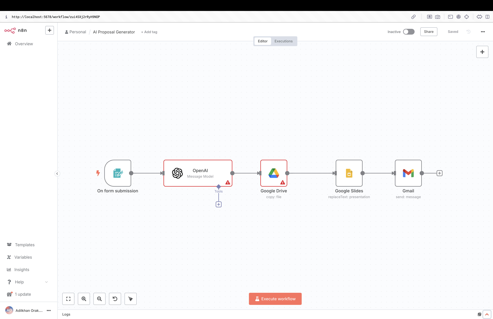

# AI Proposal Generator – n8n Workflow

## Workflow Screenshot

*Note: Any errors visible in the screenshot are due to deleted API tokens. These tokens were removed for privacy and security reasons.*

## Overview

This repository contains an n8n workflow for generating AI-powered proposals. The workflow leverages OpenAI to process AI queries in JSON format and creates custom proposals for clients by editing Google Slides presentations with the generated content.

## Features

- **Automated Proposal Generation:** Uses OpenAI to generate proposal content based on your input.
- **Google Slides Integration:** Automatically edits a Google Slides presentation with the generated proposal, ready for client review and customization.
- **JSON-Based Input:** Accepts AI queries in JSON format for flexible and structured data handling.

## How to Use

1. **Download the Workflow:**
   - Download the `AI Proposal Generator.json` file from this repository.

2. **Import into n8n:**
   - Open your n8n instance.
   - Go to the workflows section and select "Import."
   - Upload the downloaded JSON file.

3. **Configure Credentials:**
   - Set up your OpenAI and Google account credentials in n8n to enable API access.

4. **Run the Workflow:**
   - Trigger the workflow with your desired input in JSON format.
   - The workflow will generate a proposal using OpenAI and update your Google Slides presentation.

5. **Edit and Share:**
   - Review and edit the generated proposal in Google Slides as needed.
   - Share the final proposal with your client.

## Requirements

- An active n8n instance (self-hosted or cloud).
- OpenAI API key.
- Google account with access to Google Slides.
- Properly configured credentials in n8n for both OpenAI and Google APIs.
